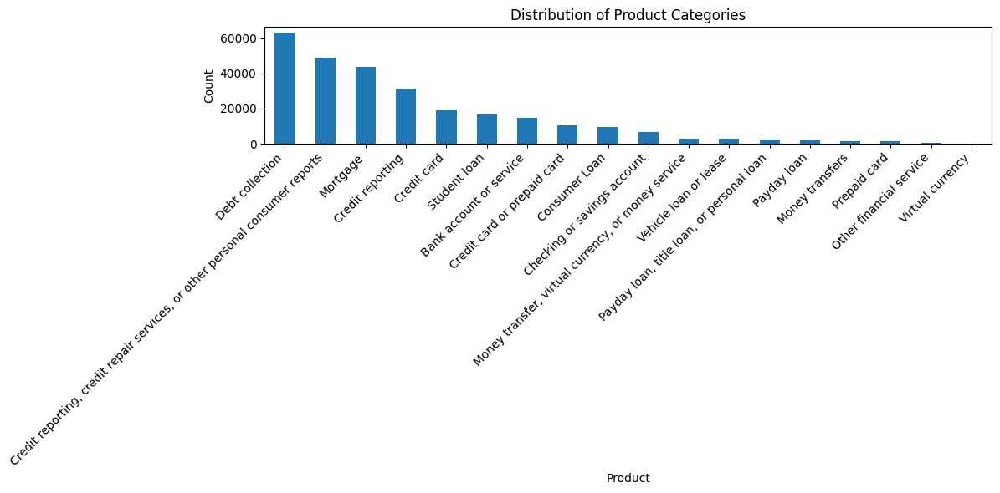
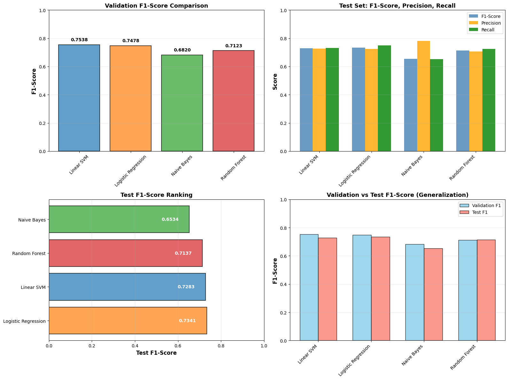
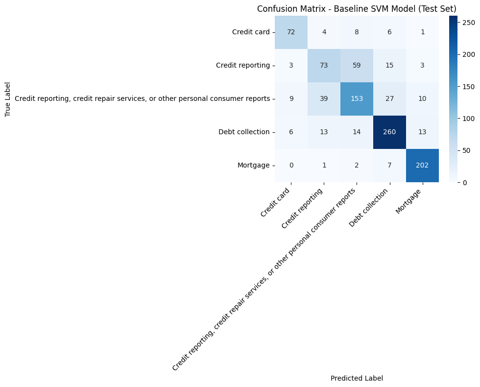
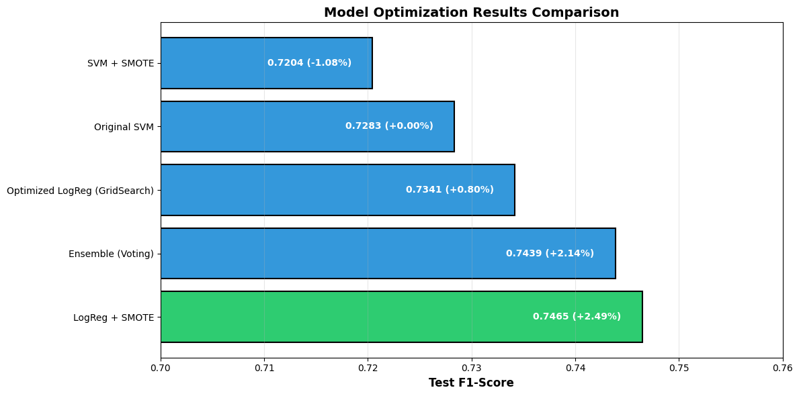
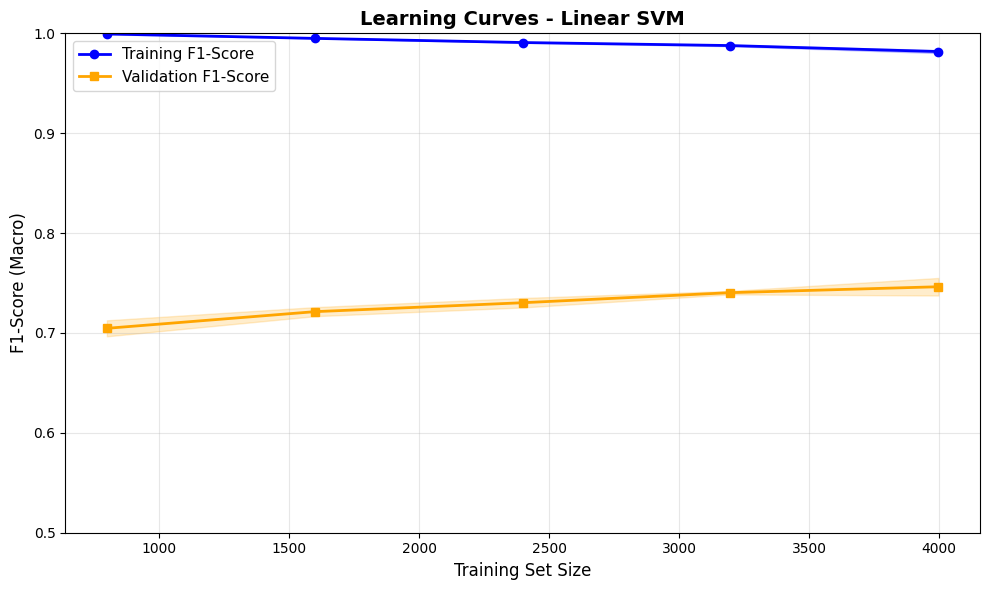

# 🏆 Consumer Complaints Classification
## ML with Advanced Optimization

**Author:** Serhat Aslan (s34090)
**Best Model:** Logistic Regression + SMOTE
**F1-Score:** 0.7465 (74.65%) | +2.49% improvement

---

# 📊 Overview

| Metric | Value |
|--------|-------|
| Total Complaints | 277,814 |
| Sample Size | 10,000 |
| Classes | 5 categories |
| Class Imbalance | 3.36:1 |
| Features | 5,000 TF-IDF |
| Train/Val/Test | 60/20/20 |

---

# 📈 Class Distribution

**Debt Collection (30.7%)** dominates, Credit Repair (7.9%) minority

---

# 🤖 Model Comparison

**Baseline Winner:** Linear SVM (F1: 0.7500)

---

# Baseline Results

| Model | F1-Score |
|-------|----------|
| **Linear SVM** | **0.7500** ⭐ |
| Logistic Regression | 0.7416 |
| Random Forest | 0.7186 |
| Naive Bayes | 0.6060 |

---

# 🎯 Confusion Matrix

**Strong on majority, weak on minority classes**

---

# 🎪 Optimization Techniques

---

# Results Comparison

| Technique | F1-Score | Improvement |
|-----------|----------|-------------|
| Baseline SVM | 0.7283 | - |
| GridSearchCV | 0.7341 | +0.80% |
| Voting Classifier | 0.7439 | +2.14% |
| **SMOTE (LogReg)** | **0.7465** | **+2.49%** 🏆 |

---

# 🏆 Best Model: SMOTE + Logistic Regression

**Final Metrics:**
- Accuracy: 0.7515
- Precision: 0.7393
- Recall: 0.7561
- **F1-Score: 0.7465**

**Why SMOTE Works:** Handles 3.36:1 class imbalance effectively

---

# 📊 Learning Curves

**~10% gap = healthy generalization, no overfitting**

---

# Per-Class Performance

| Category | F1-Score |
|----------|----------|
| Mortgage | 0.92 |
| Debt Collection | 0.86 |
| Credit Card | 0.79 |
| Credit Repair | 0.69 |
| Credit Reporting | 0.55 |

**SMOTE improved minority class recall by 2-4%**

---

# 💡 Key Insights

✅ **What Works:**
- TF-IDF captures complaint essence
- SMOTE handles imbalance (+2.49%)
- Balanced Precision ≈ Recall (no bias)
- Good generalization (train-val alignment)

⚠️ **Challenges:**
- Semantic overlap between categories
- Limited minority class samples
- TF-IDF loses word context
- Inherent imbalance ceiling

---

# 🚀 Recommendations

1. **Word Embeddings** (Word2Vec, GloVe, FastText)
2. **Deep Learning** (LSTM, CNN, Transformers)
3. **Collect More Data** for minority classes
4. **Use Metadata** (product code, issue)
5. **Hybrid Ensemble** approaches

---

# ✅ Conclusion

**Technical Achievement:**
- ✅ 277K complaints → 10K samples
- ✅ 5,000 TF-IDF features
- ✅ 4 models evaluated
- ✅ 3 optimization techniques
- ✅ 74.65% F1-score (+2.49%)

**Status:** 🚀 **Complete**

---

**Repository:** github.com/wizard17-star/Consumer-Complaints-Classification  
**Notebook:** COMPLETE_ANALYSIS.ipynb  
**Date:** January 15, 2026
